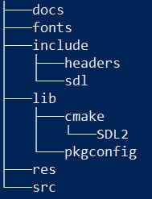
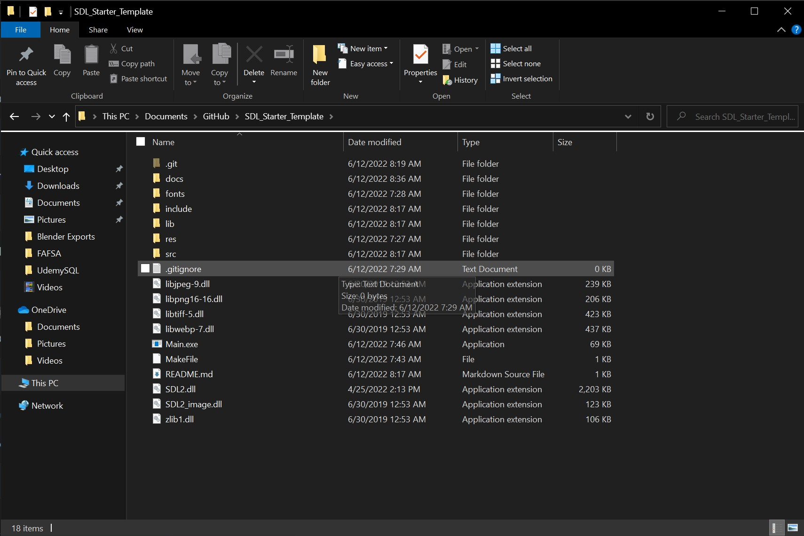
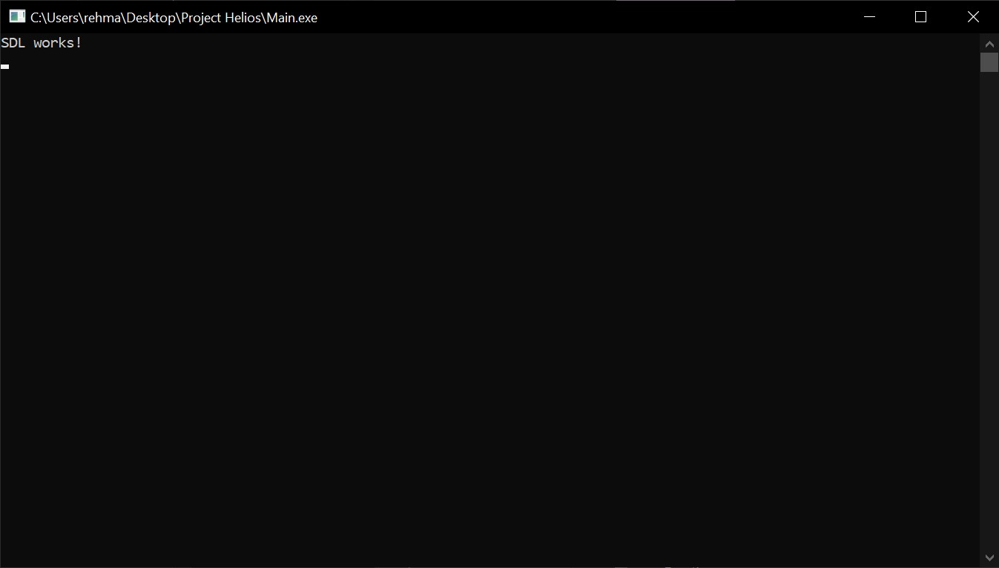

# SDL_Starter_Template

A project starter template for SDL2, C++ using MinGW for quickly getting up and running. 

Inside a powershell command prompt **(in administrator mode)** run the following command to install ```mingw```: 

    $ choco install mingw -y
    
Clone the repository and then navigate inside the project directory: 

    $ git clone https://github.com/rehman000/SDL_Starter_Template
    $ cd SDL_Starter_Template

The project folder structure is as follows:



Open up vscode inside the project repository directory:
    
    $ code .

Inside vscode fire up a new powershell terminal by pressing ```cmd + ~``` keys and then execute the ```MakeFile```: 

    $ mingw32-make -f .\MakeFile

The output should look something like this:

    g++ -Iinclude -Iinclude/sdl -Iinclude/headers -Llib -o Main src/*.cpp -lmingw32 -lSDL2main -lSDL2 -lSDL2_image

Open up file explorer for the project folder:

    $ explorer.exe .

Run the ```Main.exe```generated executable file 



Rejoice and be blessed with the following message:

    SDL Works!



So now this cloning this template repository can be the basis for starting new projects. 
The legwork has all been automated. 
